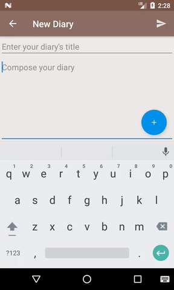
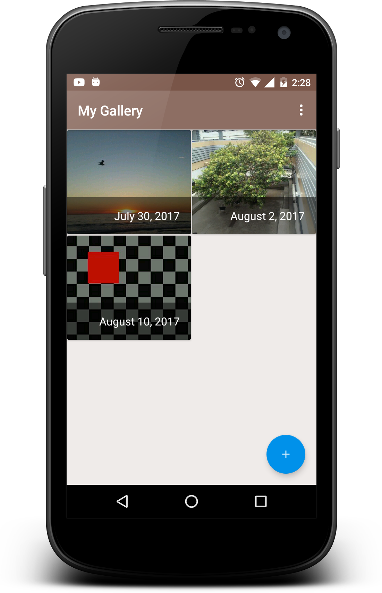

# Capstone-Project

## Overview
GeoDiary is an android app that allows users to save diaries to the cloud and retrieve them whenever they want from any device
by signing in to their email.

## Features
- Secure login with Gmail or an alternate email address
- Take a photo and attach it to diary
- Inspirational quotes are provided to be inserted into diary
- Widget that display the last inspirational quote used
- Location-aware
- Map that displays the locations where user created the diaries

## Important instructions to run the app from a development environment
In order to use the map functionality, you will need to get a Google Maps API key [here](https://developers.google.com/maps/documentation/android-api/signup).

Once obtained the key, go to the AndroidManifest.xml file and replace the value from the following lines:
```
<meta-data
    android:name="com.google.android.geo.API_KEY"
    android:value="@string/google_maps_key" />
```
Also, the current API key being used for Firebase is temporary, and will be deleted after the project is reviewed by Udacity.
So, if you get a "File google-services.json is missing" error when opening the project, you will need to create a new Firebase project and download the google-services.json file. Instructions [here](https://support.google.com/firebase/answer/7015592?hl=en).
    
## Demos
- How to attach a photo to a diary


- How to insert a quote to a diary


## Screenshots
  
